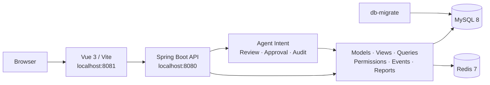

<div align="center">

# Fool Service

**A metadata-driven application framework with governed Agent workflows**

Built with **Spring Boot + Vue 3 + Docker Compose** for models, views, queries,
permissions, events, reports, and reviewable AI-assisted actions.

[](https://openjdk.org/projects/jdk/17/)
[](https://spring.io/projects/spring-boot)
[](https://vuejs.org/)
[](https://www.typescriptlang.org/)
[](https://docs.docker.com/compose/)
[](https://github.com/fool-org/fool-service/actions/workflows/repo-harness.yml)

**English** · [简体中文](README.zh-CN.md)

[Agent](#agent-workspace-and-controlled-actions) · [Quick Start](#quick-start) ·
[Architecture](#architecture) · [Modules](#modules) ·
[Development](#development-and-validation)

</div>

> [!IMPORTANT]
> **Working on this repository with a coding agent?** Start with
> [AGENTS.md](AGENTS.md). It routes agents to the current task state,
> validation commands, engineering standards, and delivery-evidence contract.

## Overview

Fool Service composes business models, interface views, data queries,
permissions, event notifications, reports, and governed Agent actions through
configuration and metadata.

| Capability | Description |
| --- | --- |
| Agent and controlled actions | Generates reviewable drafts within the current user's permissions, then uses preview, confirmation, approval, execution, and audit states for controlled actions |
| Models and views | Builds list, detail, create, child-item, and composite views from model metadata |
| Data access | Provides unified DAO, data-source routing, query, persistence, and SQL execution capabilities |
| Application management | Manages applications, working databases, menus, roles, and initialization |
| Business runtime | Provides authentication, authorization, event messaging, operations, and report workflows |
| Web workspace | Uses Vue 3 and TypeScript for the interactive application workspace |
| Reproducible environment | Starts MySQL, Redis, backend, and frontend through Docker Compose |

## Agent Workspace and Controlled Actions

After signing in, users can access two complementary Agent surfaces:

- `/agent` creates ordered, reviewable drafts for reports and queries, forms and
  views, models, data sources, and events or automation.
- `/actions` lists Action Requests the current user may review, approve, execute,
  or cancel, together with immutable previews, risk levels, and approval state.

Protected endpoints accept only `Authorization: Bearer <token>` and deny by
default. The Agent inherits the current user's application, database, resource,
row, and field scope. A model may propose a structured `ActionIntent`, but it
cannot decide permissions, risk levels, or approvals, and it cannot execute an
action directly.

- `MEDIUM` actions require an immutable preview and confirmation by the
  requester.
- `HIGH` actions require step-up verification, independent approval, and
  authorization revalidation before execution.
- `CRITICAL` actions, arbitrary SQL or code, destructive DDL, and unrestricted
  external calls are unavailable to the Agent.
- Tokens, passwords, connection strings, credentials, and `RESTRICTED` data are
  excluded from model context, Agent sessions, approval records, and normal
  logs.

Implementation and acceptance status is tracked in [tasks.md](tasks.md).
Detailed identity, risk, approval, execution, and audit rules live in the
[authorization and Agent risk-control design](docs/authorization-and-agent-risk-control.md).

## Quick Start

### 1. Requirements

- Docker Desktop or Docker Engine
- Docker Compose v2

### 2. Start the Full Stack

```bash
git clone git@github.com:fool-org/fool-service.git
cd fool-service
docker compose up -d --build
```

The first start creates the MySQL data volume and applies
`docker/mysql/init/*.sql`. The one-shot `db-migrate` service also applies
idempotent database updates to existing volumes.

To enable the AI configuration assistant in the web workspace, set at least one
provider key before starting the stack. Keys are available only to the backend
container and are never returned to the browser.

```bash
export DEEPSEEK_API_KEY="your-deepseek-key"
# or export OPENAI_API_KEY="your-openai-key"
docker compose up -d --build
```

Optional variables include `FOOL_AGENT_DEFAULT_PROVIDER`,
`DEEPSEEK_BASE_URL`, `DEEPSEEK_MODEL`, `OPENAI_BASE_URL`, and
`OPENAI_MODEL`. After signing in, open “AI Assistant” or visit `/agent`. When
no provider key is configured, the page clearly falls back to local
rule-based responses.

### 3. Check Services

```bash
docker compose ps -a
python scripts/runtime_doctor.py
```

`db-migrate` should report `Exited (0)`. Long-running services should be
running or healthy.

| Service | Address / Port | Description |
| --- | --- | --- |
| Web workspace | <http://localhost:8081/> | Vue frontend; local development account: `admin / admin` |
| Backend API | <http://localhost:8080/> | Spring Boot service |
| Health check | <http://localhost:8080/test> | Minimal backend smoke endpoint |
| MySQL | `127.0.0.1:3307` | Database `car_wash`; root password `Pa88word` |
| Redis | `127.0.0.1:6380` | Maps to container port `6379` |

> [!WARNING]
> The default account and database password are for local development only.
> Replace them through environment variables before deployment.

Common operations:

```bash
docker compose logs -f backend frontend
docker compose restart backend frontend
docker compose down
```

## Architecture



Requests enter through the Vue workspace and Spring Boot API. The runtime
combines model, data, permission, and presentation metadata. Agent intents pass
through authorization, risk, preview, approval, and audit controls before
approved operations reach the core runtime.

## Modules

| Group | Module | Responsibility |
| --- | --- | --- |
| Application entry | `business-application` | Spring Boot startup, runtime configuration, and module assembly |
| Infrastructure | `fool-common`, `fool-log`, `fool-error-handler`, `fool-dto` | Shared types, logging, error handling, and request/response models |
| Data layer | `fool-dao`, `fool-db-manage`, `fool-query` | DAO, data sources, SQL execution, and queries |
| Metadata layer | `fool-model`, `fool-view` | Models, relationships, attributes, and view definitions |
| Application capabilities | `fool-app-manage`, `fool-auth` | Application setup, database catalog, menus, roles, and authorization |
| Business capabilities | `fool-event`, `fool-report` | Event notifications, message recipients, and report workflows |
| Agent | `fool-agent` | Ordered Agent sessions, model egress control, Action Intent validation, and governed execution for `MEDIUM` and `HIGH` actions |
| Web frontend | `frontend` | Vue 3, TypeScript, Vite, and Vitest |

## Development and Validation

### Frontend Development

```bash
cd frontend
npm install
npm run dev
```

### Minimum Validation Matrix

Run the smallest check that matches the change:

| Change | Command |
| --- | --- |
| README, docs, or repository rules | `python scripts/check_repo_harness.py` |
| Vue frontend | `cd frontend && npm test && npm run build` |
| Java backend | `mvn test`, or a focused module test |
| Docker or runtime | `docker compose up -d --build && python scripts/runtime_doctor.py` |
| Authorization or Agent controls | Run backend and frontend checks, then `python scripts/harness/browser_role_matrix.py --run-id <run-id>` and the remaining strict review steps in the [authorization operations guide](docs/authorization-operations.md) |

See the [validation guide](docs/validation.md) for the full command matrix, CI
gates, and skip policy.

## Documentation

| Document | Purpose |
| --- | --- |
| [Agent guide](AGENTS.md) | First-read entrypoint for coding agents and change discipline |
| [Agent sessions](docs/agent-sessions.md) | Agent capability order, session API, and current boundaries |
| [Authorization and Agent risk control](docs/authorization-and-agent-risk-control.md) | Identity, scope, risk, approval, execution, and audit design |
| [Authorization operations](docs/authorization-operations.md) | Policy freshness, audit integrity, permission review, and security regression procedures |
| [Validation guide](docs/validation.md) | Local validation matrix, CI gates, and runtime checks |
| [Standards catalog](docs/standards/README.md) | Versioned engineering standards |
| [Task board](tasks.md) | Current work state |
| [Delivery evidence](agent_chats/README.md) | Required evidence shape for meaningful changes |

## Contributing

1. Read [AGENTS.md](AGENTS.md) and the relevant module code first.
2. Keep changes focused and update related tests and task state.
3. Run the smallest matching check from the [validation guide](docs/validation.md).
4. Record meaningful runtime, architecture, or Agent-control changes under
   `agent_chats/`.

---

<div align="center">

**Just for My Dream.**

</div>
