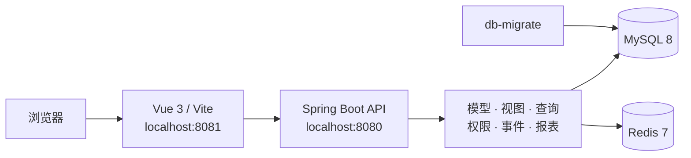

<div align="center">

# Fool Service

**一个由模型、视图、查询、权限、事件与报表驱动的应用框架**

正在将旧版 FoolFrame 的 Node / Express / Jade / Angular 工作流迁移到<br>
**Spring Boot + Vue 3 + Docker Compose** 的现代化架构。

[](https://openjdk.org/projects/jdk/17/)
[](https://spring.io/projects/spring-boot)
[](https://vuejs.org/)
[](https://www.typescriptlang.org/)
[](https://docs.docker.com/compose/)
[](https://github.com/fool-org/fool-service/actions/workflows/repo-harness.yml)

[快速开始](#快速开始) · [系统架构](#系统架构) · [模块说明](#模块说明) · [开发与验证](#开发与验证) · [迁移进度](#迁移进度)

</div>

> [!IMPORTANT]
> 项目目前处于 **FoolFrame 迁移期**。Docker 基线、Vue 主工作台以及核心 View-first 流程已经可运行，剩余兼容性工作以 [迁移对照表](docs/migration/foolframe-parity.md) 为准。

## 项目简介

Fool Service 将业务模型、界面视图、数据查询、权限、事件通知和报表能力拆成可组合模块，用配置与元数据组织常见的后台业务流程。

| 能力 | 说明 |
| --- | --- |
| 模型与视图 | 以模型元数据生成列表、详情、新建、子项和组合视图 |
| 数据访问 | 统一 DAO、数据源路由、查询、保存和 SQL 执行能力 |
| 应用管理 | 管理应用、工作数据库、菜单、角色及初始化安装流程 |
| 业务运行时 | 提供认证授权、事件消息、操作执行与报表工作流 |
| 现代化前端 | 使用 Vue 3 + TypeScript 重建旧版 FoolFrame 操作界面 |
| 可复现环境 | 使用 Docker Compose 统一启动 MySQL、Redis、后端和前端 |

## 快速开始

### 1. 环境要求

- Docker Desktop 或 Docker Engine
- Docker Compose v2

### 2. 启动完整环境

```bash
git clone git@github.com:fool-org/fool-service.git
cd fool-service
docker compose up -d --build
```

首次启动会创建 MySQL 数据卷，并自动执行 `docker/mysql/init/*.sql`。已有数据卷也会由一次性的 `db-migrate` 服务补齐幂等迁移。

### 3. 检查服务

```bash
docker compose ps -a
python scripts/runtime_doctor.py
```

`db-migrate` 应显示为 `Exited (0)`，其余长期服务应处于运行或健康状态。

| 服务 | 地址 / 端口 | 说明 |
| --- | --- | --- |
| Web 工作台 | <http://localhost:8081/> | Vue 前端，默认开发账号 `admin / admin` |
| 后端 API | <http://localhost:8080/> | Spring Boot 服务 |
| 健康检查 | <http://localhost:8080/test> | 最小后端 smoke 路由 |
| MySQL | `127.0.0.1:3307` | 数据库 `car_wash`，root 密码 `Pa88word` |
| Redis | `127.0.0.1:6380` | 映射到容器的 `6379` |

> [!WARNING]
> 默认账号和数据库密码只用于本地开发环境，部署前请通过环境变量替换。

常用运维命令：

```bash
docker compose logs -f backend frontend
docker compose restart backend frontend
docker compose down
```

## 系统架构



请求从 Vue 工作台进入 Spring Boot API，再由 View-first 运行时组合模型、数据、权限和展示元数据。Docker Compose 负责服务编排，`db-migrate` 确保新旧数据卷使用同一套数据库迁移路径。

## 模块说明

| 分组 | 模块 | 职责 |
| --- | --- | --- |
| 应用入口 | `business-application` | Spring Boot 启动、运行时配置与模块装配 |
| 基础设施 | `fool-common`、`fool-log`、`fool-error-handler`、`fool-dto` | 公共类型、日志、异常和请求响应模型 |
| 数据层 | `fool-dao`、`fool-db-manage`、`fool-query` | DAO、数据源、SQL 执行与查询能力 |
| 元数据层 | `fool-model`、`fool-view` | 模型、关系、属性和视图定义 |
| 应用能力 | `fool-app-manage`、`fool-auth` | 应用安装、数据库目录、菜单、角色和授权 |
| 业务能力 | `fool-event`、`fool-report` | 事件通知、消息收件人与报表工作流 |
| 迁移支撑 | `fool-reflect`、`fool-dynamic` | 反射发现与配置驱动的旧能力兼容 |
| Web 前端 | `frontend` | Vue 3、TypeScript、Vite 与 Vitest |

## 开发与验证

### 前端开发

```bash
cd frontend
npm install
npm run dev
```

### 最小验证矩阵

根据改动范围运行最小匹配检查：

| 改动范围 | 命令 |
| --- | --- |
| README、文档、仓库规范 | `python scripts/check_repo_harness.py` |
| Vue 前端 | `cd frontend && npm test && npm run build` |
| Java 后端 | `mvn test`，或运行聚焦模块测试 |
| Docker / 运行时 | `docker compose up -d --build && python scripts/runtime_doctor.py` |

完整命令、CI 门禁和跳过规则见 [验证指南](docs/validation.md)。

## 迁移进度

当前迁移遵循“可运行基线 → 核心工作流 → 兼容性收口”的路径：

- **已具备：** Docker Compose 全栈、数据库幂等迁移、Vue 登录与主工作台、View-first 列表/详情/新建、查询保存、操作、消息、报表，以及对应自动化验证。
- **进行中：** 继续核对 FoolFrame 剩余运行时行为，并以真实旧路由、DTO 和 Docker smoke 逐项收口。
- **唯一进度源：** [FoolFrame Migration Parity](docs/migration/foolframe-parity.md)。

README 只保留稳定概览，具体完成项、验证证据与剩余差距统一记录在迁移对照表中，避免状态重复和过期。

## 项目文档

| 文档 | 用途 |
| --- | --- |
| [迁移对照表](docs/migration/foolframe-parity.md) | FoolFrame 迁移进度、运行时证据和剩余差距 |
| [验证指南](docs/validation.md) | 本地验证矩阵、CI 门禁和运行时检查 |
| [标准目录](docs/standards/README.md) | 仓库内版本化工程标准 |
| [Agent 指南](AGENTS.md) | 自动化协作入口与变更纪律 |
| [任务看板](tasks.md) | 当前工作的状态源 |

## 参与开发

1. 先阅读 [Agent 指南](AGENTS.md) 和对应模块代码。
2. 保持改动聚焦，并同步更新相关测试与迁移状态。
3. 按 [验证指南](docs/validation.md) 运行最小匹配检查。
4. 对有意义的运行时或迁移改动，在 `agent_chats/` 中保留交付证据。

---

<div align="center">

**Just for My Dream.**

</div>
