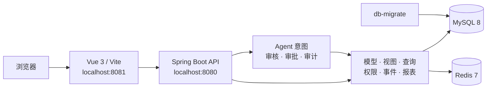

<div align="center">

# Fool Service

**一个由元数据驱动、支持受控 Agent 工作流的应用框架**

基于 **Spring Boot + Vue 3 + Docker Compose**，统一组织模型、视图、查询、
权限、事件、报表与可审核的 AI 辅助动作。

[](https://openjdk.org/projects/jdk/17/)
[](https://spring.io/projects/spring-boot)
[](https://vuejs.org/)
[](https://www.typescriptlang.org/)
[](https://docs.docker.com/compose/)
[](https://github.com/fool-org/fool-service/actions/workflows/repo-harness.yml)

[English](README.md) · **简体中文**

[Agent](#agent-工作台与受控动作) · [快速开始](#快速开始) ·
[系统架构](#系统架构) · [模块说明](#模块说明) ·
[开发与验证](#开发与验证)

</div>

> [!IMPORTANT]
> **使用开发 Agent 参与本仓库？** 请先阅读 [AGENTS.md](AGENTS.md)。
> 其中集中说明当前任务状态、验证命令、工程标准和交付证据要求。

## 项目简介

Fool Service 通过配置与元数据组合业务模型、界面视图、数据查询、权限、
事件通知、报表和受控 Agent 动作。

| 能力 | 说明 |
| --- | --- |
| Agent 与受控动作 | 在当前用户权限内生成可审核草案，并通过预览、确认、审批、执行与审计状态处理受控动作 |
| 模型与视图 | 以模型元数据生成列表、详情、新建、子项和组合视图 |
| 数据访问 | 提供统一 DAO、数据源路由、查询、保存和 SQL 执行能力 |
| 应用管理 | 管理应用、工作数据库、菜单、角色及初始化流程 |
| 业务运行时 | 提供认证授权、事件消息、操作执行与报表工作流 |
| Web 工作台 | 使用 Vue 3 与 TypeScript 提供交互式应用工作台 |
| 可复现环境 | 使用 Docker Compose 统一启动 MySQL、Redis、后端和前端 |

## Agent 工作台与受控动作

登录后可以进入两个互补的 Agent 入口：

- `/agent` 按报表与查询、表单与视图、模型、数据源、事件与自动化的顺序
  生成可审核草案。
- `/actions` 展示当前用户可查看、审批、执行或取消的 Action Request，以及
  不可变预览、风险等级和审批状态。

受保护接口只接受 `Authorization: Bearer <token>`，并默认拒绝。Agent 始终
继承当前用户的应用、数据库、资源、数据行和字段范围。模型只能提出结构化
`ActionIntent`，不能决定权限、风险等级或审批结果，也不能直接执行动作。

- `MEDIUM` 动作需要不可变预览和发起人确认。
- `HIGH` 动作需要 step-up、独立审批和执行前重新鉴权。
- `CRITICAL` 动作、任意 SQL 或代码、破坏性 DDL 和不受限外部调用不向
  Agent 开放。
- token、密码、连接串、凭据和 `RESTRICTED` 数据不会进入模型上下文、
  Agent 会话、审批记录或普通日志。

准确实施与验收状态以 [任务看板](tasks.md) 为准；身份、数据范围、风险、
审批、执行与审计规则见
[权限与 Agent 风控设计](docs/authorization-and-agent-risk-control.md)。

## 快速开始

### 1. 环境要求

- Docker Desktop 或 Docker Engine
- Docker Compose v2

### 2. 启动完整环境

```bash
git clone git@github.com:fool-org/fool-service.git
cd fool-service
docker compose up -d --build
```

首次启动会创建 MySQL 数据卷，并执行 `docker/mysql/init/*.sql`。一次性的
`db-migrate` 服务也会为已有数据卷应用幂等数据库更新。

如需启用 Web 工作台中的 AI 配置助手，请在启动前设置至少一个 provider
密钥。密钥只进入后端容器，不会返回给浏览器。

```bash
export DEEPSEEK_API_KEY="your-deepseek-key"
# 或 export OPENAI_API_KEY="your-openai-key"
docker compose up -d --build
```

可选变量包括 `FOOL_AGENT_DEFAULT_PROVIDER`、`DEEPSEEK_BASE_URL`、
`DEEPSEEK_MODEL`、`OPENAI_BASE_URL` 和 `OPENAI_MODEL`。登录后可点击
“AI 助手”或直接访问 `/agent`；未配置密钥时，页面会明确使用本地规则回复。

### 3. 检查服务

```bash
docker compose ps -a
python scripts/runtime_doctor.py
```

`db-migrate` 应显示为 `Exited (0)`，其余长期服务应处于运行或健康状态。

| 服务 | 地址 / 端口 | 说明 |
| --- | --- | --- |
| Web 工作台 | <http://localhost:8081/> | Vue 前端；本地开发账号 `admin / admin` |
| 后端 API | <http://localhost:8080/> | Spring Boot 服务 |
| 健康检查 | <http://localhost:8080/test> | 最小后端 smoke 路由 |
| MySQL | `127.0.0.1:3307` | 数据库 `car_wash`；root 密码 `Pa88word` |
| Redis | `127.0.0.1:6380` | 映射到容器的 `6379` |

> [!WARNING]
> 默认账号和数据库密码只用于本地开发环境，部署前请通过环境变量替换。

常用运维命令：

```bash
docker compose logs -f backend frontend
docker compose restart backend frontend
docker compose down
```

## 系统架构



请求从 Vue 工作台进入 Spring Boot API，再由运行时组合模型、数据、权限和
展示元数据。Agent 意图必须经过鉴权、风险判定、预览、审批与审计控制，
获准后才能进入核心运行时。

## 模块说明

| 分组 | 模块 | 职责 |
| --- | --- | --- |
| 应用入口 | `business-application` | Spring Boot 启动、运行时配置与模块装配 |
| 基础设施 | `fool-common`、`fool-log`、`fool-error-handler`、`fool-dto` | 公共类型、日志、异常和请求响应模型 |
| 数据层 | `fool-dao`、`fool-db-manage`、`fool-query` | DAO、数据源、SQL 执行与查询能力 |
| 元数据层 | `fool-model`、`fool-view` | 模型、关系、属性和视图定义 |
| 应用能力 | `fool-app-manage`、`fool-auth` | 应用初始化、数据库目录、菜单、角色和授权 |
| 业务能力 | `fool-event`、`fool-report` | 事件通知、消息收件人与报表工作流 |
| Agent | `fool-agent` | 有序 Agent 会话、模型出站控制、Action Intent 校验，以及 `MEDIUM` / `HIGH` 受控动作的审批与执行编排 |
| Web 前端 | `frontend` | Vue 3、TypeScript、Vite 与 Vitest |

## 开发与验证

### 前端开发

```bash
cd frontend
npm install
npm run dev
```

### 最小验证矩阵

根据改动范围运行最小匹配检查：

| 改动范围 | 命令 |
| --- | --- |
| README、文档、仓库规范 | `python scripts/check_repo_harness.py` |
| Vue 前端 | `cd frontend && npm test && npm run build` |
| Java 后端 | `mvn test`，或运行聚焦模块测试 |
| Docker / 运行时 | `docker compose up -d --build && python scripts/runtime_doctor.py` |
| 权限 / Agent 风控 | 运行后端与前端检查，再执行 `python scripts/harness/browser_role_matrix.py --run-id <run-id>`，并按 [授权运行手册](docs/authorization-operations.md) 完成其余严格权限审查和可逆安全回归 |

完整命令、CI 门禁和跳过规则见 [验证指南](docs/validation.md)。

## 项目文档

| 文档 | 用途 |
| --- | --- |
| [Agent 指南](AGENTS.md) | 开发 Agent 的首读入口与变更纪律 |
| [Agent 会话机制](docs/agent-sessions.md) | Agent 能力顺序、会话 API 和当前边界 |
| [权限与 Agent 风控设计](docs/authorization-and-agent-risk-control.md) | 身份、数据范围、风险、审批、执行与审计设计 |
| [授权运行手册](docs/authorization-operations.md) | 策略新鲜度、审计完整性、权限复核和安全回归操作 |
| [验证指南](docs/validation.md) | 本地验证矩阵、CI 门禁和运行时检查 |
| [标准目录](docs/standards/README.md) | 仓库内版本化工程标准 |
| [任务看板](tasks.md) | 当前工作状态源 |
| [交付证据](agent_chats/README.md) | 有意义改动的交付证据格式 |

## 参与开发

1. 先阅读 [Agent 指南](AGENTS.md) 和对应模块代码。
2. 保持改动聚焦，并同步更新相关测试与任务状态。
3. 按 [验证指南](docs/validation.md) 运行最小匹配检查。
4. 对有意义的运行时、架构或 Agent 风控改动，在 `agent_chats/` 中保留
   交付证据。

---

<div align="center">

**Just for My Dream.**

</div>
